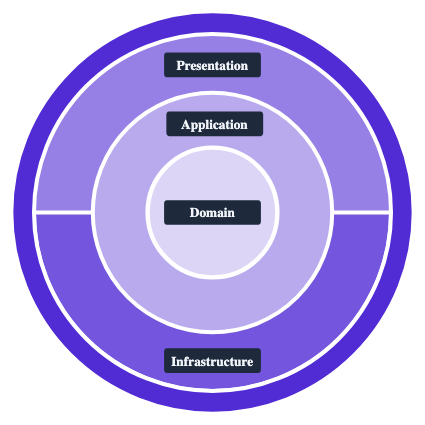
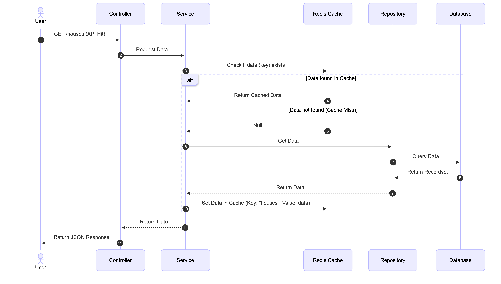

#  House Broker Application

This project is a **Minimum Viable Product (MVP)** for a House Broker Application. It is designed to serve two distinct user roles: **house seekers** and **real estate brokers**, with a secure authentication system differentiating between them.

The application provides a comprehensive platform for brokers to manage property listings—handling essential details like property type, location, price, features, images, and descriptions. For house seekers, the application offers a robust showcase feature that allows them to search and filter properties based on their specific criteria.

**GitHub Repository:** [dev-saurav-adhikari/house-broker](https://github.com/dev-saurav-adhikari/house-broker)

---

## Key Features

- **Listing Management:** Full CRUD operations for brokers to manage properties, with data integrity ensured by the database.
- **Dynamic Commission Engine:** An automated system that calculates estimated broker commissions based on tiered property prices (ranging from 1.5% to 2%). 
  - *Note:* These configurable rates are stored in the database, and the calculated commission is kept private, visible only to the listing's broker.
- **Reliability:** The core business rules, including the commission engine and listing service logic, are backed by a suite of unit tests.

---

## Tech Stack & Architecture

The application is built using modern **.NET** technologies and utilizes an **MSSQL** database for data storage. The system is strictly designed around **Clean Architecture** principles to ensure a highly maintainable, scalable, and organized codebase with **Redis** serving as the caching layer.

### Clean Architecture Overview

In clean architecture, the fundamental rule is simple: **Dependencies point inward.** Outer layers depend on inner layers. Inner layers never depend on outer layers.



#### The Four Layers

| Layer | Type | Description |
| :--- | :--- | :--- |
| **Domain** | Class Library | Encapsulates core business logic and rules. The heart of the application. |
| **Application** | Class Library | Defines use cases and orchestrates business operations. |
| **Infrastructure** | Class Library | Implements persistence (MSSQL), Redis caching, and external service integrations. |
| **Presentation (Web)** | ASP.NET Core Web API | The entry point to the system; maps HTTP requests to Application commands/queries. |

---

### Project Structure

```text
CleanArchitecture.slnx
│
├── CleanArchitecture.Domain/       ← Innermost layer (zero dependencies)
│   ├── Entities/                   ← Objects with identity (e.g., TodoList, TodoItem)
│   ├── Enums/                      ← Strongly typed enumerations
│   ├── ValueObjects/               ← Immutable objects defined by their values
│   └── Events/                     ← Domain events
│
├── CleanArchitecture.Application/   ← Business logic (depends on Domain)
│   ├── DTOs/
│   ├── Interfaces/
│   └── UseCases/
│
├── CleanArchitecture.Infrastructure/ ← Data access (depends on Application)
│   ├── Persistence/
│   │   └── AppDbContext.cs
│   ├── Repositories/
│   ├── Services/
│   ├── Migrations/
│   └── DependencyInjection.cs
│
└── CleanArchitecture.Presentation/  ← Presentation layer (depends on Application + Infrastructure)
    ├── Controllers/
    ├── Program.cs
    └── appsettings.json
```

---

## Caching with Redis

Caching is a performance optimization technique where copies of frequently accessed data are temporarily stored in a high-speed memory layer. Instead of querying the primary, slower data store (like your MSSQL database) every single time a user requests information, the application first checks the cache.

In this project, **Redis** is used for caching. Because it keeps data in RAM rather than on a traditional disk drive, read and write operations are exceptionally fast.

>
> Caching is implemented for **commission settings** and **property fetching** to ensure maximum responsiveness.



---

## Unit Testing

Unit Testing is a software verification technique where individual components or units of code are tested in isolation to ensure they function correctly. The tests isolate specific functions, ensuring business logic behaves as expected under various conditions without relying on external systems like databases.

---

##  How to Run the Project

To fulfill the requirements for easy setup and consistent database configuration, this project has been fully **Dockerized**.

### What is Docker?
Docker is a platform that uses containerization to package an application and all of its required dependencies—including the .NET API, the MSSQL database, and the Redis cache—into standardized units called containers.

### Steps to Run:

1. **Open Terminal:** Navigate to the directory containing the `compose.yml` file.
2. **Launch Services:**
   ```bash
   docker compose up --build
   ```
3. **Wait for Services:** Wait for the containers to be built and started.
4. **Access API:** Once running, you can access the application at: [http://localhost:5107/openapi/v1.json](http://localhost:5107/openapi/v1.json)

---

## Conclusion

This project successfully delivers a **Minimum Viable Product (MVP)** for the House Broker Application, fulfilling the core objectives of utilizing .NET, an MSSQL database, and strictly adhering to Clean Architecture principles.

By integrating secure user authentication, comprehensive listing management, and a dynamic, database-configurable commission engine, the application provides a robust and scalable foundation for both real estate brokers and house seekers.

---

> 
> Thank you for reviewing this project. I would be happy to discuss the technical design choices made or provide any further clarification on the implementation of these requirements.
